  

  <a href="https://github.com/nicoe-x?tab=repositories">我的仓库</a> ·
  <a href="https://github.com/nicoe-x/wjx_auto_answer">小工具</a> ·
  <a href="https://github.com/nicoe-x?tab=stars">我的收藏</a>

### 01 / 你好，我是十二

也可以叫我 **Nicoe**。

喜欢从具体的小问题出发，动手改一点，再让它好用一点。这里收纳我的工具、创作和实验，也给还没成形的想法留个位置。

### 02 / 给下一个想法留白

让重复的事情简单一点，让有意思的想法具体一点。

新的作品，慢慢补上。

---

十二 / Nicoe · 保持好奇，继续动手。

